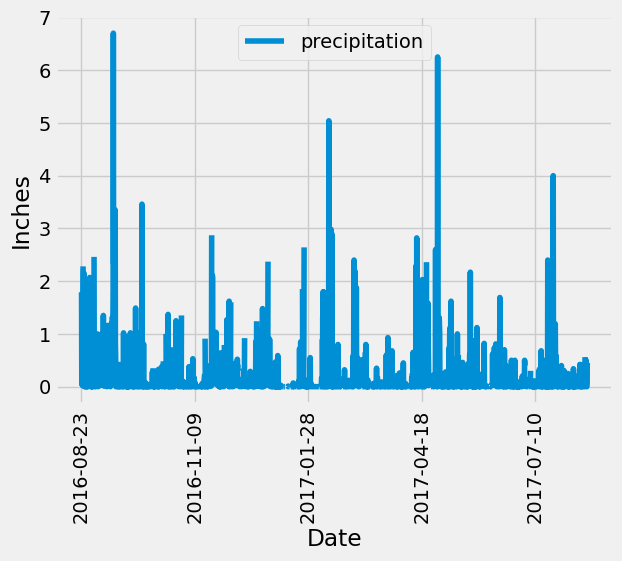

# sqlalchemy-challenge
### - Overview
- Module 10 SQL Challenge files
- Author: Vinny Shankar
- Acknowledgements:
    - Study Groups: worked together with several students to understand the assignment
    - Classmates: [Hany Dief](https://github.com/hanydief) and [Jed Miller](https://github.com/Jed-Miller) were instrumental in helping understand Flask APIs
    - Program: University of California Berkeley Data Analytics Bootcamp
    - Starter Code: The Module Challenge provided starter code that guided the process
    - Instructor: Ahmad Sweed
    - TA: Brian Perry
    - Tutor: Bethany Lindberg
### - Contents
- One SurfsUp folder containing:
    * A Jupyter Notebook of SQLAlchemy queries and Climate Analysis
    * A .py file contaning a Flask API
    * A Resources folder containing a .sqlite database and two .csv files
    * An images folder containing .png files of plots
- This README.md file
### - Climate Analysis
- Precipitation Analysis
    * A plot of the latest year of precipitation data           
    
- Station Analysis
    * A histogram of the latest year of temperature observations for the weather station with the highest number of observations            
    
### - Climate App
- Uses Flask to serve data from the hawaii.sqlite database to the user
- Defined routes for:
    * `/`
        - returns list of available url routes
    * `/api/v1.0/precipitation`
        - returns JSON list of dictionaries for latest 12 months of precipitation data with dates as keys and precipitation observations as values
    * `/api/v1.0/precipitation_most_active_station`
        - returns a JSON dictionary for latest 12 months of precipitation data for most active station with dates as keys and precipitation observations as values
    * `/api/v1.0/stations`
        - returns JSON list of stations
    * `/api/v1.0/stations_advanced`
        - returns JSON list containing a dictionary for each station
        - dictionary keys: station id, station number, station name, station elevation, station latitude, station longitude
    * `/api/v1.0/tobs`
        - returns a JSON list of the latest year of temperature data for the most active station
        - the JSON list contains one dictionary with dates as keys and `tobs` (observed temperatures) as values
    * `/api/v1.0/tobs_only`
        - returns a JSON list of only the `tobs` for the latest year of data for the most active station
    * `/api/v1.0/start`
        - returns an error message if user's date is out of range or not in YYYY-MM-DD format
        - returns a JSON list containing one dictionary of summary temperature statistics for dates between the user's start date & the latest date in the dataset
        - dictionary keys: user's start date, latest date in the dataset, average temperature (TAVG), maximum temperature (TMAX), minimum temperature (TMIN)
    * `/api/v1.0/start/end`
        - returns an error message if user's dates are out of range, out of order, or not in YYYY-MM-DD format
        - returns a JSON list containing one dictionary of summary temperature statistics for dates between the user's start & the user's end date
        - dictionary keys: user's start date, user's end date, average temperature (TAVG), maximum temperature (TMAX), minimum temperature (TMIN)
